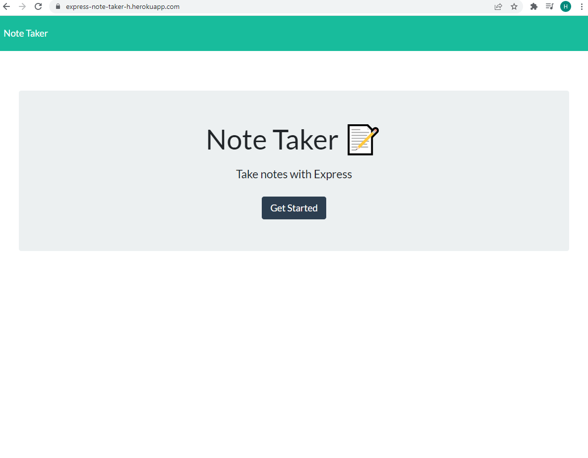
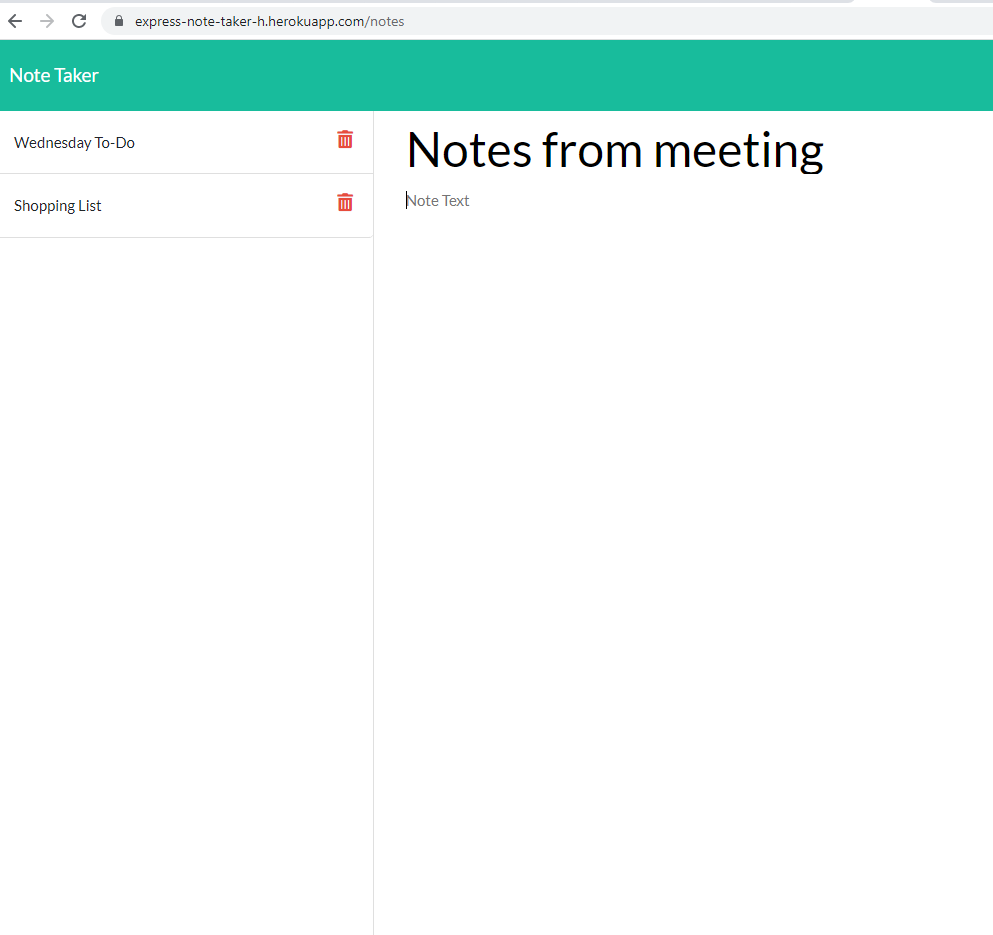
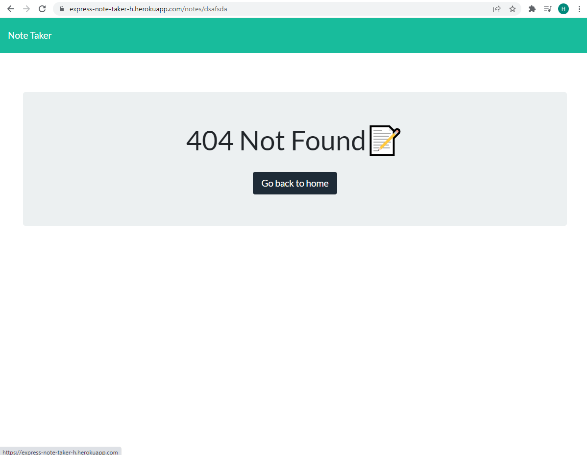

# Note Taker

[License: MIT](https://img.shields.io/badge/License-MIT-yellow.svg)

## Table of Contents

- [Description](#description)

- [Screenshots](#screenshots)

- [Link](#link)

- [Built With](#built-with)

- [Future Considerations](#future-considerations)

- [License](#license)

- [Contact](#contact)

- [Acknowledgements](#acknowledgements)

## Description
Note-taking app built with Express.js which allows user to write notes and save them. Previously saved notes can be viewed and deleted. 

## Screenshots
Homepage

Saved notes displayed on the left; field to write new note/view previous note on right.

404 page displayed when invalid url typed.

## Link
https://express-note-taker-h.herokuapp.com/

## Built With

HTML

CSS

Bootstrap

JavaScript

Node.js

Express.js

## Future Considerations
Add ability to edit saved notes with put route.

## License
This project is covered under the MIT license.

For more information see: 
https://opensource.org/licenses/MIT

## Contact
You can direct any questions or feedback you have about the app to:

Email: peterson.hj@outlook.com

GitHub: https://github.com/hannahj25

## Acknowledgements
App is built off of starter code provided by the University of Adelaide's Coding Boot Camp. 